# Mengambil Data Google Sheets dan Menambah Feature

Panduan ini membantu kamu menghubungkan data Google Sheets ke halaman dashboard. Contoh utamanya memakai feature `man-power` yang sudah ada, jadi kamu bisa membuka file sumber sambil mengikuti penjelasannya. Untuk AI Agent, bagian terakhir merangkum urutan kerja dan batasan yang perlu diperhatikan.

## Gambaran Alur

```mermaid
flowchart LR
  A["🧩 Komponen"] -->|"membaca config"| B["📋 SHEETS_REGISTRY"]
  B --> C["🪝 useSheetData\n(spreadsheetKey, sheetKey)"]
  C --> D["⚡ fetchData"]
  D --> E["🔍 fetchAndValidateSheet"]
  E -->|"HTTP request"| F["☁️ Google Sheets API"]

  F -->|"raw rows"| G["🗂️ Mapping kolom\nsesuai schema"]
  G --> H["✅ Validasi\nsetiap baris"]
  H -->|"data valid / error"| I["📦 TanStack Query"]
  I -->|"return"| A

  style A fill:#6366f1,color:#fff,stroke:#4f46e5
  style B fill:#f59e0b,color:#fff,stroke:#d97706
  style C fill:#8b5cf6,color:#fff,stroke:#7c3aed
  style D fill:#3b82f6,color:#fff,stroke:#2563eb
  style E fill:#3b82f6,color:#fff,stroke:#2563eb
  style F fill:#10b981,color:#fff,stroke:#059669
  style G fill:#f97316,color:#fff,stroke:#ea580c
  style H fill:#14b8a6,color:#fff,stroke:#0d9488
  style I fill:#ec4899,color:#fff,stroke:#db2777
```



| File                                                          | Kegunaan                                                              |
| ------------------------------------------------------------- | --------------------------------------------------------------------- |
| [sheets-registry.ts](../src/config/sheets-registry.ts)        | ID spreadsheet serta nama tab, range, dan schema setiap sheet         |
| [sheet-config.types.ts](../src/config/sheet-config.types.ts)  | Tipe `SheetConfig<T>` dan `SpreadsheetConfig`                         |
| [use-sheet-data.ts](../src/hooks/use-sheet-data.ts)           | Shared query hooks melalui `fetchData`                                |
| [fetch.ts](../src/lib/google-sheets/fetch.ts)                 | Request Sheets dan validasi per baris melalui `fetchAndValidateSheet` |
| [client.ts](../src/lib/google-sheets/client.ts)               | URL request dan API key dari environment                              |
| [helper.ts](../src/lib/google-sheets/helper.ts)               | Mapping kolom, pembersihan sel, dan konversi tanggal                  |
| [types.ts](../src/lib/google-sheets/types.ts)                 | Tipe nilai sel dan baris                                              |
| [schema Man Power](../src/features/man-power/schema/index.ts) | Schema data Man Power                                                 |

## Sebelum Mulai

Tambahkan API key ke `.env.local` di root proyek:

```dotenv
VITE_SHEETS_API_KEY=isi_api_key_untuk_environment_kamu
```

Restart development server setelah mengubah environment. Jangan menyalin key asli ke dokumentasi atau commit.

## Menentukan Range dan Urutan Kolom

Konfigurasi Man Power berada di `SHEETS_REGISTRY.manPower`, dengan sheetKey `employees`, tab `DATA MP (UPDATED)`, dan range `D2:V`.

- `spreadsheetId`: ID dokumen, yaitu bagian setelah `/d/` pada URL spreadsheet, bukan angka `gid` tab.
- `sheetName`: nama tab di dalam dokumen, ditulis sesuai sumbernya.
- `range`: area dengan notasi A1 yang dimulai dari **baris data pertama**, tanpa header atau judul.
- `schema`: `z.object(...)` yang mendefinisikan field sesuai urutan kolom dalam range.

**Parser tidak membaca nama header dan tidak melewati baris pertama.** Jika header berada di baris 1, mulai range dari baris 2, misalnya `A2:C`.

Field diperoleh melalui `Object.keys(schema.shape)`. Field pertama mengambil sel pertama dalam range, field kedua mengambil sel kedua, dan seterusnya. Tulis field dalam format camelCase sesuai kebutuhan. Nama field tidak perlu sama dengan header Sheets.

Contoh: range `A2:C` berisi kolom Kode, Nama, Jumlah. Schema harus berurutan `code`, `name`, `quantity`.

## Membuat Schema Feature

Gunakan `z.object(...)` sebagai schema utama. Transformasi dapat dilakukan pada field, misalnya konversi tanggal.

| Kebutuhan             | Schema                         | Catatan                                                      |
| --------------------- | ------------------------------ | ------------------------------------------------------------ |
| Teks wajib            | `z.string().min(1)`            | Sel kosong dibersihkan menjadi `null`, lalu ditolak          |
| Teks opsional         | `z.string().nullable()`        | Menerima sel kosong sebagai `null`                           |
| Angka asli            | `z.number()`                   | Menolak string angka seperti `"12"`                          |
| Angka opsional        | `z.number().nullable()`        | Menerima angka atau `null`                                   |
| Angka dengan konversi | `z.coerce.number().nullable()` | Gunakan jika konversi memang diinginkan; `null` tetap `null` |

Parser menormalkan sel sebelum validasi:

| Input                                                | Hasil               |
| ---------------------------------------------------- | ------------------- |
| String kosong atau hanya spasi                       | `null`              |
| Sel hilang (`undefined`) atau `null`                 | `null`              |
| Error sel yang dikenali, seperti `#N/A` atau `#REF!` | `null`              |
| Teks berisi nilai, seperti `" Bagus "`               | Tetap `" Bagus "`   |
| Angka `0` atau boolean `false`                       | Tetap dipertahankan |

Parser tidak memfilter baris kosong. Baris kosong yang dikirim sumber bisa lolos jika semua field menerima `null`. `.optional()` saja tidak menerima sel kosong hasil parser, karena nilainya sudah menjadi `null`.

Contoh mapping dengan field `code`, `name`, `quantity`:

```ts
// Baris mentah, tanpa header
[["INV-001", "Pensil", 12], ["INV-002", "Buku"]]

// Setelah mapping, sebelum validasi
[
  { code: "INV-001", name: "Pensil", quantity: 12 },
  { code: "INV-002", name: "Buku", quantity: null },
]
```

Untuk tanggal, pola Man Power menerima angka serial Sheets atau `null`:

```ts
import { z } from "zod"
import { sheetsSerialToDate } from "@/lib/google-sheets/helper"

const sheetDateField = () =>
  z
    .number()
    .nullable()
    .transform((value) => (value === null ? null : sheetsSerialToDate(value)))
```

Hasilnya `Date | null`. Teks tanggal seperti `"16/09/2026"` ditolak. Helper memakai epoch UTC 30 Desember 1899. Tampilan tanggal lokal mengikuti zona waktu yang digunakan komponen.

## Menambah Feature Baru

Contoh berikut adalah template inventory dengan urutan kolom **Kode, Nama, Jumlah**, header di baris 1, dan data mulai baris 2. Sesuaikan dengan sumber sebenarnya.

### 1. Buat schema

Buat `src/features/inventory/schema/index.ts`:

```ts
import { z } from "zod"

export const inventorySchema = z.object({
  code: z.string().min(1),
  name: z.string().min(1),
  quantity: z.number().nullable(),
})

export type Inventory = z.infer<typeof inventorySchema>
```

### 2. Daftarkan sumber

Di `src/config/sheets-registry.ts`, tambahkan import:

```ts
import { inventorySchema } from "@/features/inventory/schema"
```

Tambahkan properti berikut **di dalam** object `SHEETS_REGISTRY`, sambil mempertahankan entri yang sudah ada:

```ts
inventory: {
  spreadsheetId: "GANTI_DENGAN_ID_SPREADSHEET_INVENTORY",
  sheets: {
    items: {
      sheetName: "Inventory",
      range: "A2:C",
      schema: inventorySchema,
    },
  },
},
```

Jika tab baru berada dalam spreadsheet yang sudah terdaftar, cukup tambahkan entri ke `sheets` milik spreadsheet tersebut.

### 3. Ambil data di komponen

```tsx
import { useSheetData } from "@/hooks/use-sheet-data"

export function InventorySummary() {
  const { data, isPending, isError } = useSheetData("inventory", "items")

  if (isPending) return <p>Sedang memuat data…</p>
  if (isError) return <p>Data gagal dimuat. Coba lagi nanti.</p>
  if (data.length === 0) return <p>Belum ada data inventory.</p>

  return <p>Ada {data.length} baris inventory yang valid.</p>
}
```

Argumen pertama adalah key spreadsheet di registry, argumen kedua adalah key sheet di dalamnya, bukan nama tab.

Untuk Man Power, gunakan:

```ts
const { data, isPending, isError } = useSheetData("manPower", "employees")
```

Lihat [halaman Man Power](../src/pages/man-power-dashboard.tsx) untuk contoh lengkap.

## Validasi dan Penanganan Error

`fetchAndValidateSheet` mengembalikan `{ data, invalidCount, errors }`. `data` hanya berisi baris yang valid. `invalidCount` adalah jumlah baris yang tidak valid. `errors` memuat baris yang tidak valid beserta alasan errornya.

| Kondisi                                                  | Hasil                                                                                |
| -------------------------------------------------------- | ------------------------------------------------------------------------------------ |
| Semua baris valid                                        | Return data                                                                          |
| Sebagian baris tidak valid                               | Return data valid dan `console.warn` jumlah baris yang dilewati beserta detail error |
| Ada baris, tetapi semuanya tidak valid                   | Throw error. Penyebab error dapat dilihat pada `cause`                               |
| Respons tidak memiliki `values` atau berisi array kosong | Return `[]`                                                                          |
| Fetch/API gagal                                          | Throw error dengan pesan `Gagal memuat data: ...` dan penyebab error di `cause`      |

## Jika Data Gagal Dimuat atau Tidak Sesuai

| Error                            | Yang perlu diperiksa                                                            |
| -------------------------------- | ------------------------------------------------------------------------------- |
| `VITE_SHEETS_API_KEY is not set` | Isi `.env.local` dan restart development server                                 |
| Error HTTP dari Sheets           | Pesan API, API key, izin sumber, ID dokumen, nama tab, dan range                |
| Warning baris dilewati           | Detail `issues`, posisi baris relatif terhadap range, dan tipe sel              |
| Semua baris gagal validasi       | Urutan field schema, tipe data, serta header yang ikut masuk range              |
| Nilai masuk ke field yang salah  | Urutan kolom dan field                                                          |
| Tanggal gagal divalidasi         | Pastikan sumber mengirim angka, bukan teks tanggal                              |
| Baris kosong malah tampil        | Parser tidak membuang baris kosong. Periksa aturan nullable schema              |
| Hasil kosong tanpa error         | Respons `values`, range, dan cek apakah sumber memang kosong                    |
| Key hook ditolak TypeScript      | Daftarkan spreadsheet dan sheet di registry. Gunakan key object, bukan nama tab |

## Panduan untuk AI Agent

- Selalu baca registry, tipe konfigurasi, shared hooks, fetch, helper, dan schema terkait sebelum mengubah implementasi.
- Konfirmasi urutan kolom, baris data pertama, tipe nilai, serta format tanggal sumber. Jangan mengarang ID spreadsheet atau nama tab.
- Buat schema di `src/features/<nama-feature>/schema/index.ts`, tambahkan entri registry, lalu gunakan `useSheetData` dari komponen.
- Pertahankan schema utama sebagai `z.object(...)`, gunakan camelCase, dan cocokkan urutan field dengan kolom dalam range.
- Letakkan transformasi khusus feature pada field schema. Jangan melonggarkan validasi hanya untuk menyembunyikan error.
- Untuk alur fetch standar, gunakan shared hooks. Tidak perlu membuat ulang file `.api.ts` dan `.query.ts` per feature.
- Saat mengubah implementasi, periksa data valid, sebagian invalid, semua invalid, kosong, dan kegagalan fetch. Jalankan pemeriksaan yang relevan dan laporkan hasil sebenarnya.
